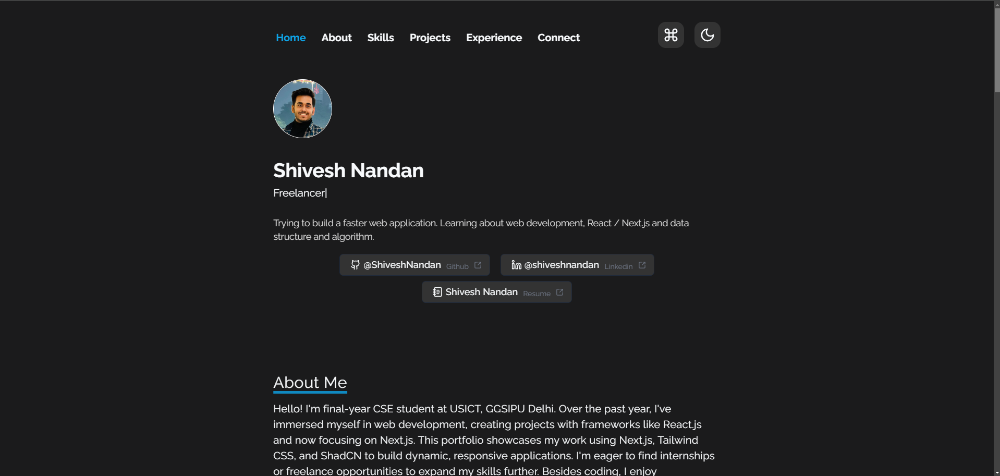

<h2 align="center">
  A personal Porfolio created with Boilerplate<br/>
</h2>
  <p>Trying to create a customizable, responsive portfolio template designed for individuals to showcase their work professionally. It offers an elegant, user-friendly interface that can be easily personalized, with sections for introduction, skills, about me, projects, experience and contact information. Ideal for developers, designers, and creatives.</p>



With the moto of : <i>Try to improve daily !!</i>
## Installation

Follow these steps to install and start the project:

1. Clone the repository : </br>
```bash
$ git clone https://github.com/ShiveshNandan/Portfolio-template.git
```

2. Navigate to the project directory : </br>
```bash
$ cd my-app
```

3. Install the dependencies : </br>
```bash
$ npm install
```

4. Run the server :
```bash
$ npm run dev
```


